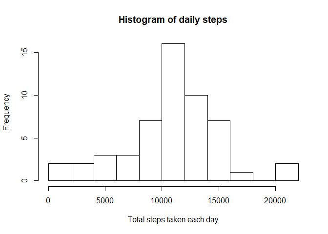
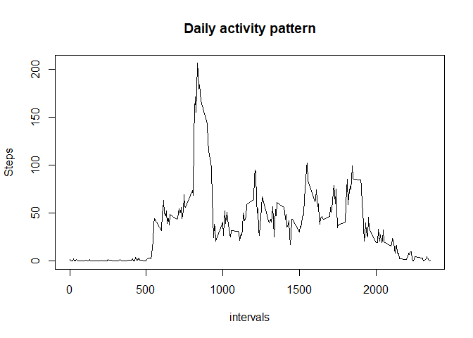
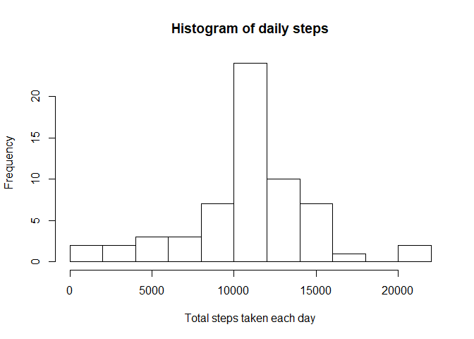
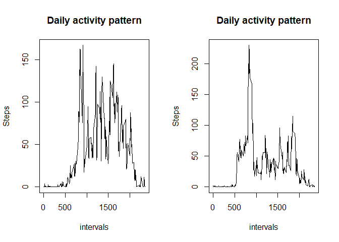

## Loading and preprocessing the data

```r
library(dplyr)
```

```
## 
## Attaching package: 'dplyr'
```

```
## The following objects are masked from 'package:stats':
## 
##     filter, lag
```

```
## The following objects are masked from 'package:base':
## 
##     intersect, setdiff, setequal, union
```

```r
unzip("activity.zip")
data <- read.csv("activity.csv")
```

## What is mean total number of steps taken per day?
### Calculate the total number of steps taken per day

```r
data1 <- aggregate(data$steps,by=list(Category=data$date),FUN=sum)
```
### Histogram of steps taken

```r
hist(data1$x, breaks=10,main = "Histogram of daily steps", xlab = "Total steps taken each day")
```

<!-- -->

### Mean and median of total steps taken each day

```r
dailymean <- mean(data1$x,na.rm=TRUE)
dailymedian <- median(data1$x,na.rm=TRUE)
dailymean
```

```
## [1] 10766.19
```

```r
dailymedian
```

```
## [1] 10765
```

## What is the average daily activity pattern?
### Find the average steps taken for each interval and plot

```r
data.avg <- aggregate(data$steps,by=list(interval=data$interval),FUN=mean,na.rm=TRUE)
plot(data.avg$interval,data.avg$x, type= "l",xlab="intervals",ylab="Steps",main="Daily activity pattern")
```

<!-- -->

### Which interval contains the maximum steps?

```r
int <- data.avg[order(data.avg$x,decreasing=TRUE),]
int$interval[1]
```

```
## [1] 835
```

## Imputing missing values
### Count the number of missing values


```r
count.NA <- sum(!complete.cases(data))
count.NA
```

```
## [1] 2304
```

### To replace all missing values with the mean of the respective intervals

```r
data.clean <- left_join(data,data.avg,by="interval")
data.noNA <- mutate(data.clean, newsteps = ifelse(is.na(steps),x,steps))
data.noNA <- data.frame(steps=data.noNA$newsteps,date=data$date,interval=data$interval)
```

### Histogram of data without missing data

```r
data.noNA.sum <- aggregate(data.noNA$steps,by=list(Date=data.noNA$date),FUN=sum)
hist(data.noNA.sum$x, breaks=10,main = "Histogram of daily steps", xlab = "Total steps taken each day")
```

<!-- -->

### Daily mean and median

```r
dailymean.noNA <- mean(data.noNA.sum$x,na.rm=TRUE)
dailymedian.noNA <- median(data.noNA.sum$x,na.rm=TRUE)
dailymean.noNA
```

```
## [1] 10766.19
```

```r
dailymedian.noNA
```

```
## [1] 10766.19
```

## Are there differences in activity patterns between weekdays and weekends?
### Create new factor variable

```r
dayofweek<- weekdays(as.Date(data.noNA$date))
data.days <- cbind(data.noNA,dayofweek)

data.week <- mutate(data.days, weekend = ifelse(dayofweek == "Saturday" | dayofweek == "Sunday","Weekend","Weekday"))
data.weekend <- filter(data.week,weekend == "Weekend")
data.weekday <- filter(data.week,weekend == "Weekday")

data.weekend.int <- aggregate(data.weekend$steps,by=list(Category=data.weekend$interval),FUN=mean)
data.weekday.int <- aggregate(data.weekday$steps,by=list(Category=data.weekday$interval),FUN=mean)
```

### Plot to compare activity

```r
par(mfrow=c(1,2))
plot(data.weekend.int$Category,data.weekend.int$x,type="l",xlab="intervals",ylab="Steps",main="Daily activity pattern")
plot(data.weekday.int$Category,data.weekday.int$x,type="l",xlab="intervals",ylab="Steps",main="Daily activity pattern")
```

<!-- -->

